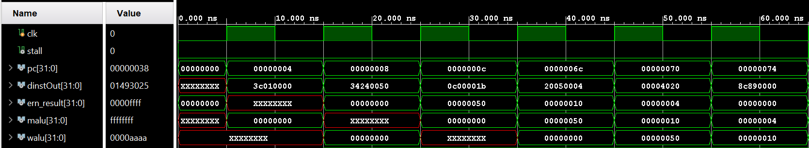
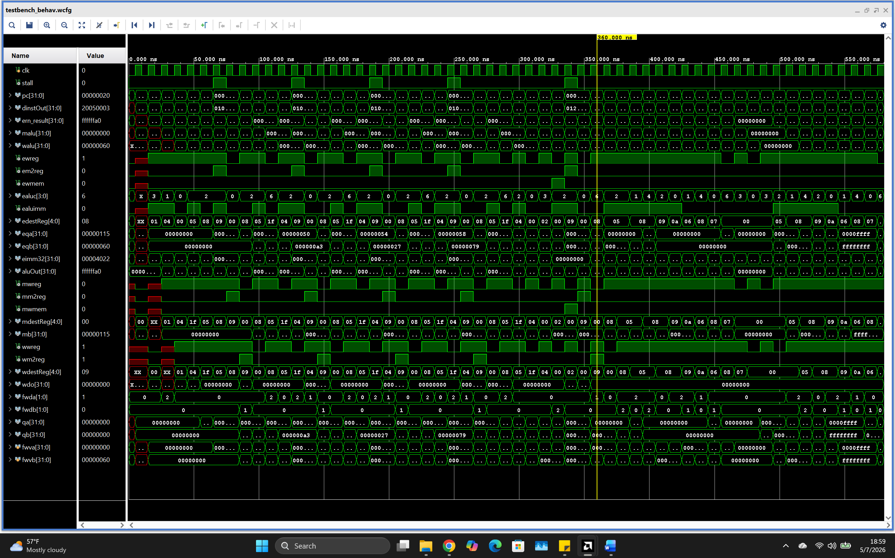
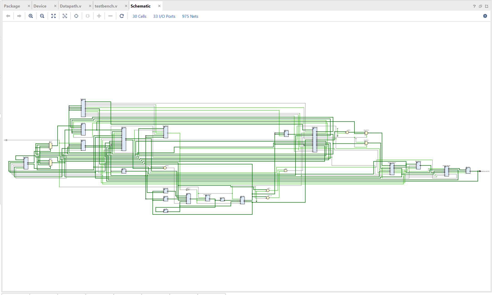
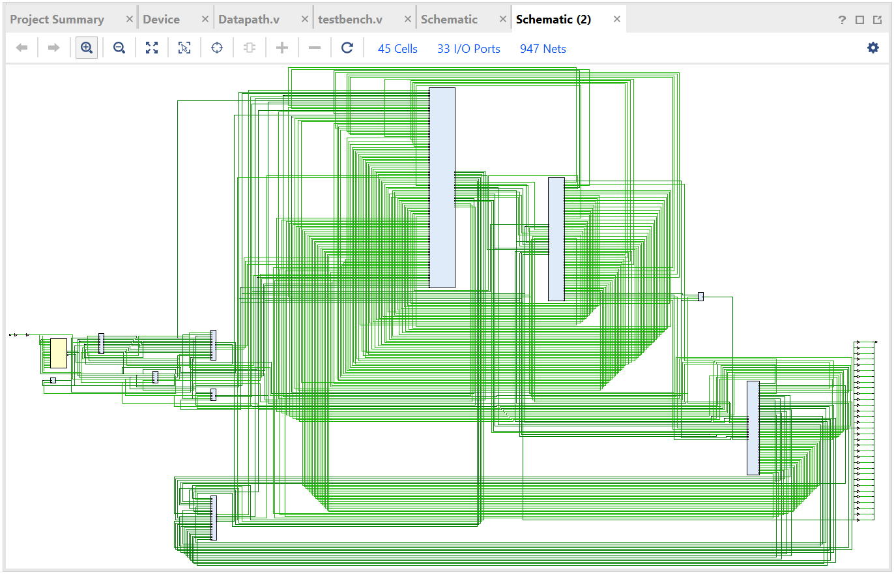
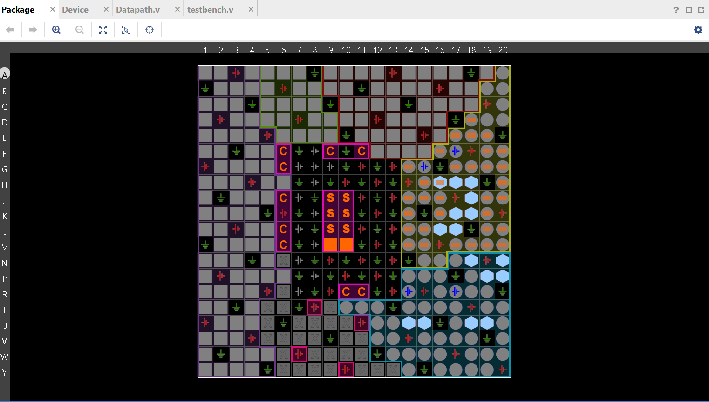
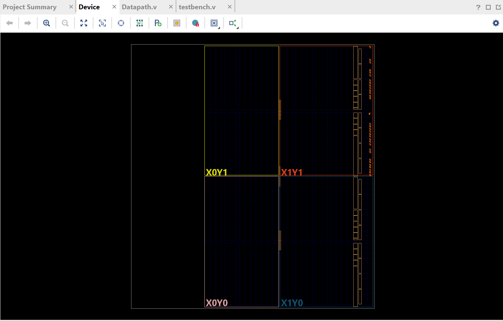

# Pipelined MIPS CPU

A 5-stage pipelined MIPS processor written in Verilog, verified in simulation, and carried
through synthesis, place & route, and bitstream generation on a Xilinx Zynq-7000 FPGA
(`XC7Z010-CLG400-1`).

```
IF → ID → EXE → MEM → WB
```

## Highlights

- **Full 5-stage pipeline** with a 9-module datapath: PC, instruction memory, register
  file, ALU, data memory, control unit, and three pipeline registers (IF/ID, ID/EXE,
  EXE/MEM, MEM/WB)
- **Data hazard forwarding** from both the MEM and WB stages into the EXE stage, resolved
  by a dedicated forwarding unit each cycle
- **Load-use hazard detection and stalling**, inserting a pipeline bubble only when
  forwarding alone can't resolve the dependency
- **Full branch/jump support** — `beq`, `bne`, `j`, `jal`, `jr` — with the branch
  comparison resolved during decode to cut the pipeline penalty, plus `jal`/`jr` return
  address handling
- **13 MIPS instructions implemented**: `lw`, `sw`, `beq`, `bne`, `addi`, `andi`, `ori`,
  `xori`, `lui`, `j`, `jal`, R-type ALU ops (`add`, `sub`, `and`, `or`, `xor`, `slt`), and
  shifts (`sll`, `srl`, `sra`)

## Verified in simulation

A self-checking testbench drives a 23-instruction test program (loads, stores, branches,
a jump-and-link subroutine call, and back-to-back shift instructions) and traces every
pipeline register cycle-by-cycle.

**IF/ID stage bring-up** — confirming instruction fetch and decode timing before layering
in the rest of the pipeline:



**Full pipeline trace** — all five stages running concurrently, including a stall bubble
(visible as the `sub`-after-`lw` dependency resolves) and forwarding paths keeping the ALU
fed with up-to-date values every cycle:



## From RTL to silicon

The design was elaborated, synthesized, placed, and routed in Xilinx Vivado, ending in a
generated bitstream.

**Elaborated design** — the datapath as Vivado sees it straight from RTL, before any
technology mapping:



**Post-synthesis schematic** — the same datapath after synthesis maps it onto Zynq-7000
primitives:



**I/O planning** across the device fabric:



**Floorplanning** — the placed and routed design mapped onto the die:




## Tools

Verilog · Xilinx Vivado 2025.2 · Zynq-7000 FPGA (`xc7z010clg400-1`)
